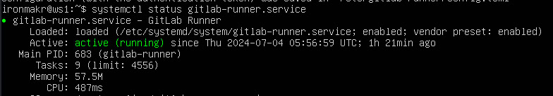
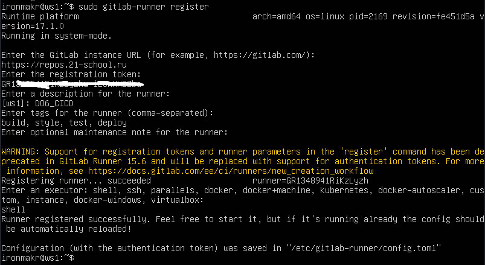
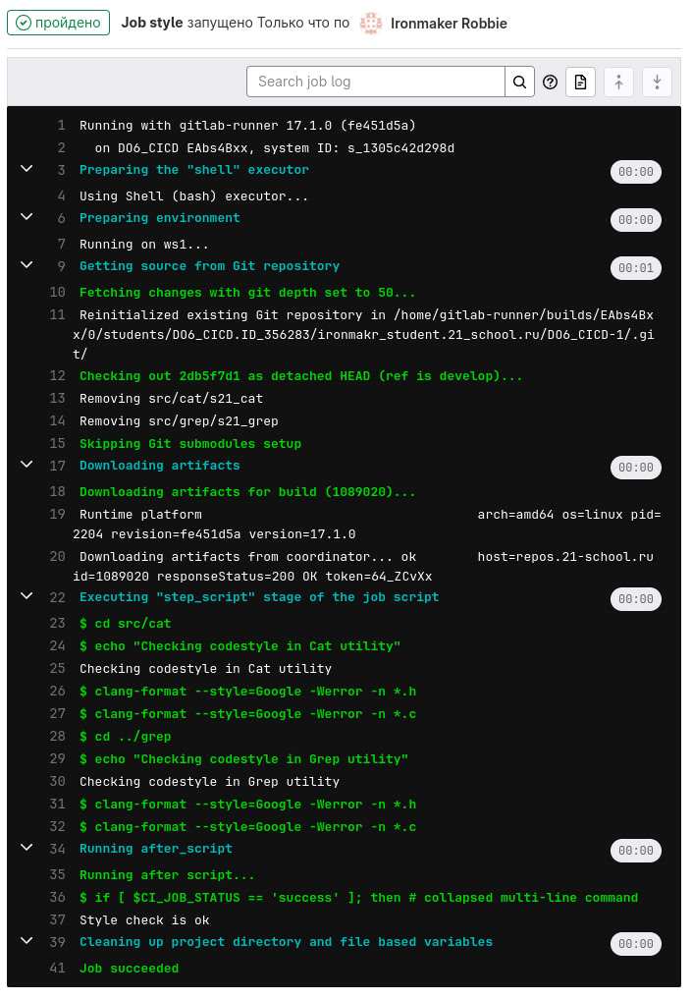

# Basic CI/CD

## Contents

1. [Chapter I](#chapter-i) \
   1.1. [Настройка gitlab-runner](#part-1-настройка-gitlab-runner)  
   1.2. [Сборка](#part-2-сборка)  
   1.3. [Тест кодстайла](#part-3-тест-кодстайла)   
   1.4. [Интеграционные тесты](#part-4-интеграционные-тесты)  
   1.5. [Этап деплоя](#part-5-этап-деплоя)  
   1.6. [Дополнительно. Уведомления](#part-6-дополнительно-уведомления)


## Chapter I

### Part 1. Настройка **gitlab-runner**

**== Задание ==**

##### Подними виртуальную машину *Ubuntu Server 22.04 LTS*.


##### Скачай и установи на виртуальную машину **gitlab-runner**.
```bash
curl -L "https://packages.gitlab.com/install/repositories/runner/gitlab-runner/script.deb.sh" | sudo bash
```
```bash
sudo apt-get install gitlab-runner
```


##### Запусти **gitlab-runner** и зарегистрируй его для использования в текущем проекте (*DO6_CICD*).
- Для регистрации понадобятся URL и токен, которые можно получить на страничке задания на платформе.
```bash
sudo gitlab-runner register
```


### Part 2. Сборка

**== Задание ==**

#### Напиши этап для **CI** по сборке приложений из проекта *C2_SimpleBashUtils*.

##### В файле _gitlab-ci.yml_ добавь этап запуска сборки через мейк файл из проекта _C2_.

##### Файлы, полученные после сборки (артефакты), сохрани в произвольную директорию со сроком хранения 30 дней.
- Build Job:<br>
<br>

- Result:<br>


### Part 3. Тест кодстайла

**== Задание ==**

#### Напиши этап для **CI**, который запускает скрипт кодстайла (*clang-format*).
- Style Job:<br>
<br>

##### Если кодстайл не прошел, то «зафейли» пайплайн.

##### В пайплайне отобрази вывод утилиты *clang-format*.
- Отстутсвие clang-format на машине с раннером:<br>
<br>
- Устанавливаем clang-format на ws1 с помощью команды:<br>

```bash
sudo apt install -y clang-format
```
- Успешная работа пайплайна:<br>
<br>

- Изменим файл s21_grep_functions.c:<br>
<br>

- Проверим на локальной машине, что ошибка выдаётся:<br>
<br>

- Проверим в пайплайне, что ошибка выдаётся:<br>
<br>

P.S. После проверки выдачи ошибки при некорректной проверке на стиль кода всё было возвращено в начальное состояние, т.е. без ошибок

### Part 4. Интеграционные тесты

**== Задание ==**

#### Напиши этап для **CI**, который запускает твои интеграционные тесты из того же проекта.

##### Запусти этот этап автоматически только при условии, если сборка и тест кодстайла прошли успешно.

##### Если тесты не прошли, то «зафейли» пайплайн.

##### В пайплайне отобрази вывод, что интеграционные тесты успешно прошли / провалились.
- Test Job:<br>
<br>

- Проверка запуска только с корректными build и style(пропущен, т.к. зафейлен кодстайл):<br>
<br>

- Изменим немного тестовый скрипт для того, чтобы появились ошибки:<br>
<br>

- Т.к. появились ошибки в исполнении тестов, то пайплайн зафейлен:<br>
<br>

P.s. перед следующим шагом был исправлен тестовый скрипт, чтобы ошибки отсутствовали<br>

- Успешное завершение тестирования:<br>
<br>

### Part 5. Этап деплоя

**== Задание ==**

##### Подними вторую виртуальную машину *Ubuntu Server 22.04 LTS*.
<br>

#### Напиши этап для **CD**, который «разворачивает» проект на другой виртуальной машине.

##### Запусти этот этап вручную при условии, что все предыдущие этапы прошли успешно.

##### Напиши bash-скрипт, который при помощи **ssh** и **scp** копирует файлы, полученные после сборки (артефакты), в директорию */usr/local/bin* второй виртуальной машины.
- Будь готов объяснить по скрипту, как происходит перенос.

- Для начала необходимо настроить связь между двумя машинами. Здесь нам пригодится опыт из LinuxNetwork part2<br>
- ws1, installer-config:<br>
<br>

```bash
sudo netplan apply
```
- ws1, ip a:<br>
<br>

- ws2, installer-config:<br>
<br>

```bash
sudo netplan apply
```
- ws2, ip a:<br>
<br>

- ping ws2 from ws1:<br>
<br>
- ping ws1 from ws2:<br>
<br>

- Затем пишем bash-скрипт, который копирует файлы на вторую машину:<br>
<br>

##### В файле _gitlab-ci.yml_ добавь этап запуска написанного скрипта.
<br>

В результате ты должен получить готовые к работе приложения из проекта *C2_SimpleBashUtils* (s21_cat и s21_grep) на второй виртуальной машине.<br>
<br>

##### В случае ошибки «зафейли» пайплайн.
- Фейлился пайплайн сначала при передаче файлов(обменялся ключами), затем при перемещении(дал права доступа). Оба решения закомментированы в script.sh <br>
- Ошибка в передаче файлов:<br>
<br>
- Ошибка в перемещении файлов:<br>
<br>

##### Сохрани дампы образов виртуальных машин.
**P.S. Ни в коем случае не сохраняй дампы в гит!**
- Не забудь запустить пайплайн с последним коммитом в репозитории.

- ws2:<br>
<br>
- ws2:<br>
<br>


### Part 6. Дополнительно. Уведомления

**== Задание ==**

##### Настрой уведомления о успешном/неуспешном выполнении пайплайна через бота с именем «[твой nickname] DO6 CI/CD» в *Telegram*.
- Текст уведомления должен содержать информацию об успешности прохождения как этапа **CI**, так и этапа **CD**.
- В остальном текст уведомления может быть произвольным.

- Проверим выдачу неуспешного пайплайна:<br>
<br>
Исправим ошибку в стиле(специально созданную)<br>
- Проверим выдачу успешного пайплайна:<br>
<br>

