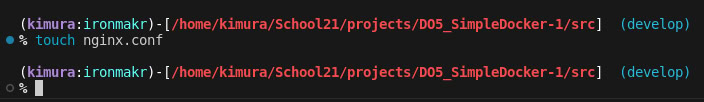
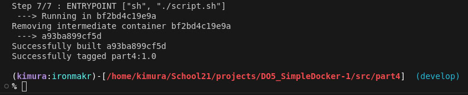
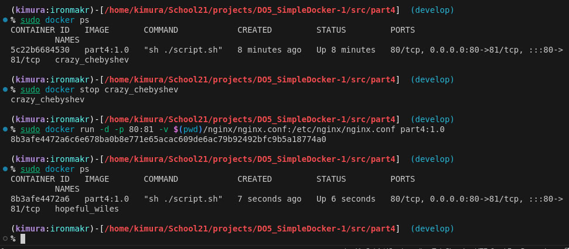
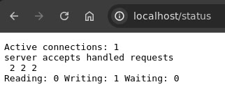

code# Simple Docker

## Contents
1. [Chapter III](#chapter-iii) \
    3.1. [Готовый докер](#part-1-готовый-докер) \
    3.2. [Операции с контейнером](#part-2-операции-с-контейнером) \
    3.3. [Мини веб-сервер](#part-3-мини-веб-сервер) \
    3.4. [Свой докер](#part-4-свой-докер) \
    3.5. [Dockle](#part-5-dockle) \
    3.6. [Базовый Docker Compose](#part-6-базовый-docker-compose)

## Chapter III

## Part 1. Готовый докер

**== Задание ==**

##### 1) Возьми официальный докер-образ с **nginx** и выкачай его при помощи `docker pull`.


##### 2) Проверь наличие докер-образа через `docker images`.


##### 3) Запусти докер-образ через `docker run -d [image_id|repository]`.


##### 4) Проверь, что образ запустился через `docker ps`.


##### 5) Посмотри информацию о контейнере через `docker inspect [container_id|container_name]`.


##### 6) По выводу команды определи и помести в отчёт размер контейнера, список замапленных портов и ip контейнера.
- Размер:<br>
<br>
- Замапленные порты:<br>
<br>
- IP контейнера:<br>
<br>

##### 7) Останови докер образ через `docker stop [container_id|container_name]`.


##### 8) Проверь, что образ остановился через `docker ps`.


##### 9) Запусти докер с портами 80 и 443 в контейнере, замапленными на такие же порты на локальной машине, через команду *run*.


##### 10) Проверь, что в браузере по адресу *localhost:80* доступна стартовая страница **nginx**.


##### 11) Перезапусти докер контейнер через `docker restart [container_id|container_name]`.
##### 12)Проверь любым способом, что контейнер запустился.
- Перезапуск контейнера с проверкой:<br>


- В отчёт помести скрины:
  - вызова и вывода всех использованных в этой части задания команд;
  - стартовой страницы **nginx** по адресу *localhost:80* (адрес должен быть виден).

## Part 2. Операции с контейнером

**== Задание ==**

##### 1) Прочитай конфигурационный файл *nginx.conf* внутри докер контейнера через команду *exec*.
<br>

##### 2) Создай на локальной машине файл *nginx.conf*.
<br>

##### 3) Настрой в нем по пути */status* отдачу страницы статуса сервера **nginx**.
<br>

##### 4) Скопируй созданный файл *nginx.conf* внутрь докер-образа через команду `docker cp`.
<br>

##### 5) Перезапусти **nginx** внутри докер-образа через команду *exec*.
<br>

##### 6) Проверь, что по адресу *localhost:80/status* отдается страничка со статусом сервера **nginx**.
<br>

##### 7) Экспортируй контейнер в файл *container.tar* через команду *export*.
<br>

##### 8) Останови контейнер.
<br>

##### 9) Удали образ через `docker rmi [image_id|repository]`, не удаляя перед этим контейнеры.
<br>

##### 10) Удали остановленный контейнер.
<br>

##### 11) Импортируй контейнер обратно через команду *import*.
<br>

##### 12) Запусти импортированный контейнер.
<br>

##### 13) Проверь, что по адресу *localhost:80/status* отдается страничка со статусом сервера **nginx**.
<br>

- В отчёт помести скрины:
  - вызова и вывода всех использованных в этой части задания команд;
  - содержимое созданного файла *nginx.conf*;
  - страницы со статусом сервера **nginx** по адресу *localhost:80/status*.

## Part 3. Мини веб-сервер

**== Задание ==**

##### 1) Напиши мини-сервер на **C** и **FastCgi**, который будет возвращать простейшую страничку с надписью `Hello World!`.
<br>

##### 2) Запусти написанный мини-сервер через *spawn-fcgi* на порту 8080.
- 2.1) Импортируем образ контейнера из tar-файла:<br>
<br>
- 2.2) Запускаем контейнер и проверяем, что он запущен:<br>
<br>
- 2.3) Копируем наш сервер в контейнер:<br>
<br>
- 2.4) Устанавливаем зависимости для компиляции и запуска:<br>
<br>
- 2.5) Компилируем и запускаем сервер:<br>
<br>

##### 3) Напиши свой *nginx.conf*, который будет проксировать все запросы с 81 порта на *127.0.0.1:8080*.
- 3.1) Файл nginx.conf с прослушиванием 81 порта и сервером на 8080 порту:<br>
<br>
- 3.2) Копируем файл nginx.conf и перезапускаем nginx:<br>
<br>

##### 4) Проверь, что в браузере по *localhost:81* отдается написанная тобой страничка.
<br>

##### 5) Положи файл *nginx.conf* по пути *./nginx/nginx.conf* (это понадобится позже).
<a href="#nginx.conf">Пункт 3.2</a>

## Part 4. Свой докер

**== Задание ==**

#### 1) Напиши свой докер-образ, который:
##### 1.1) собирает исходники мини сервера на FastCgi из [Части 3](#part-3-мини-веб-сервер);
##### 1.2) запускает его на 8080 порту;
##### 1.3) копирует внутрь образа написанный *./nginx/nginx.conf*;
##### 1.4) запускает **nginx**.
- Dockerfile:<br>
<br>
- Entrypoint script:<br>
<br>

##### 2) Собери написанный докер-образ через `docker build` при этом указав имя и тег.
```bash
sudo docker build -t part4:1.0 .
```
- docker build start:<br>
<br>
- docker build finish:<br>
<br>

##### 3) Проверь через `docker images`, что все собралось корректно.
```bash
docker images
```
<br>

##### 4) Запусти собранный докер-образ с маппингом 81 порта на 80 на локальной машине и маппингом папки *./nginx* внутрь контейнера по адресу, где лежат конфигурационные файлы **nginx**'а (см. [Часть 2](#part-2-операции-с-контейнером)).
```bash
sudo docker run -d -p 80:81 -v $(pwd)/nginx/nginx.conf:/etc/nginx/nginx.conf part4:1.0
```
<br>

##### 5) Проверь, что по localhost:80 доступна страничка написанного мини сервера.
<br>

##### 6)  Допиши в *./nginx/nginx.conf* проксирование странички */status*, по которой надо отдавать статус сервера **nginx**.
<br>

##### 7)  Перезапусти докер-образ.
```bash
sudo docker ps
```
```bash
sudo docker stop container
```
```bash
sudo docker run -d -p 80:81 -v $(pwd)/nginx/nginx.conf:/etc/nginx/nginx.conf part4:1.0
```
```bash
sudo docker ps
```
<br>

##### 8) Проверь, что теперь по *localhost:80/status* отдается страничка со статусом **nginx**
<br>

## Part 5. **Dockle**

**== Задание ==**

##### 1) Просканируй образ из предыдущего задания через `dockle [image_id|repository]`.
```bash
sudo dockle part4:1.0
```
- Dockle result before changes:<br>
<br>

##### 2) Исправь образ так, чтобы при проверке через **dockle** не было ошибок и предупреждений.
- Changed Dockerfile:<br>
<br>
```bash
sudo dockle -ak NGINX_GPGKEY -ak NGINX_GPGKEY_PATH -ak NGINX_GPGKEYS -ak NGINX_GPGKEYS_PATH  part5:1.0
```
- Dockle result after changes:<br>
<br>

## Part 6. Базовый **Docker Compose**

**== Задание ==**

##### 1) Напиши файл *docker-compose.yml*, с помощью которого:
##### 1.1) Подними докер-контейнер из [Части 5](#part-5-инструмент-dockle) _(он должен работать в локальной сети, т.е. не нужно использовать инструкцию **EXPOSE** и мапить порты на локальную машину)_.
##### 1.2) Подними докер-контейнер с **nginx**, который будет проксировать все запросы с 8080 порта на 81 порт первого контейнера.
- Dockerfile:<br>
<br>
- Entrypoint script:<br>
<br>
- nginx.conf:<br>
<br>

##### 2) Замапь 8080 порт второго контейнера на 80 порт локальной машины.
<br>

##### 3) Останови все запущенные контейнеры.
<br>

##### 4) Собери и запусти проект с помощью команд `docker-compose build` и `docker-compose up`.
- build:<br>
<br>
- up:<br>
<br>

##### 5) Проверь, что в браузере по *localhost:80* отдается написанная тобой страничка, как и ранее.
- localhost:<br>
<br>
- localhost/status:<br>
<br>
