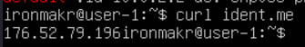
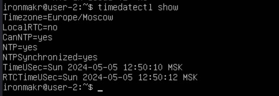
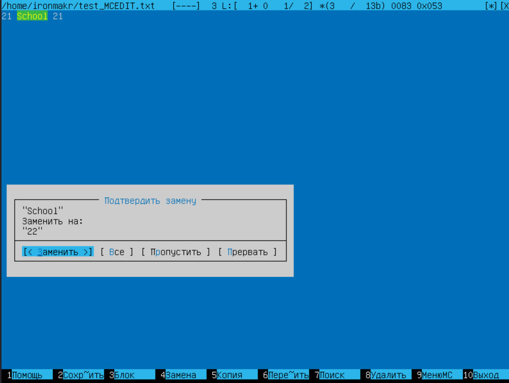
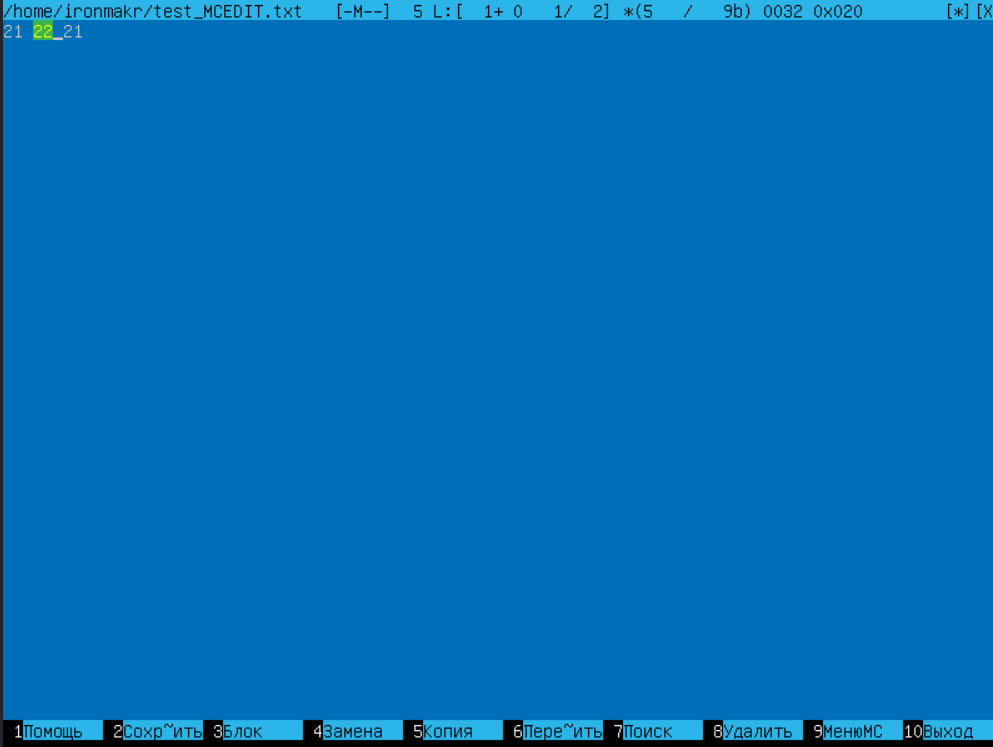

## Part 1. Установка ОС

**== Задание ==**

##### Установи **Ubuntu 20.04 Server LTS** без графического интерфейса. (Используем программу для виртуализации - VirtualBox)

- Узнай версию Ubuntu, выполнив команду \
`cat /etc/issue.`
- Вставь скриншот с выводом команды.

## Part 2. Создание пользователя

**== Задание ==**

##### Создай пользователя, отличного от созданного при установке. Пользователь должен быть добавлен в группу `adm`.

- Вставь скриншот вызова команды для создания пользователя.

- Новый пользователь должен быть в выводе команды \
`cat /etc/passwd`
- Вставь скриншот с выводом команды.

## Part 3. Настройка сети ОС

**== Задание ==**

##### Задай название машины вида user-1.

##### Установи временную зону, соответствующую твоему текущему местоположению. 
 - $ timedatectl list-timezones - получаем список доступных часовых поясов и находим нужный(Europe/Moscow)

##### Выведи названия сетевых интерфейсов с помощью консольной команды.
 
- В отчёте дай объяснение наличию интерфейса lo. 
Интерфейс lo - виртуальный интерфейс, присутствующий в Linux по умолчанию.
Интерфейс замыкается на себя, используется для отладки сетевых программ на текущем устройстве и обладает dns-именем <b><i>localhost</i></b>.

##### Используя консольную команду, получи ip адрес устройства, на котором ты работаешь, от DHCP сервера. 
 
IP адрес текущего устройства: <b><i>10.0.2.15</i></b>. 
DHCP расшифровывается как <b>D</b>ynamic <b>H</b>ost <b>C</b>onfiguration <b>P</b>rotocol и используется для автоматического присваивания параметров связи для устройств в сети.

##### Определи и выведи на экран внешний ip-адрес шлюза (ip) и внутренний IP-адрес шлюза, он же ip-адрес по умолчанию (gw). 
 
Внешний IP адрес: <b><i>176.52.79.196</i></b>. 
 
Внутренний IP адрес: <b><i>10.0.2.2</i></b>. 

##### Задай статичные (заданные вручную, а не полученные от DHCP сервера) настройки ip, gw, dns (используй публичный DNS серверы, например 1.1.1.1 или 8.8.8.8).  
- $ sudo nano /etc/netplan/00-installer-config.yaml - с помощью nano редактируем файл настроек сети.
 Изменённый файл: 
 
- $ sudo netplan apply - чтобы сохранить изменения настроек.

##### Перезагрузи виртуальную машину. Убедись, что статичные сетевые настройки (ip, gw, dns) соответствуют заданным в предыдущем пункте.  
- $ reboot - для перезагрузки
- $ ip addr - для проверки сетевых настроек 
 

- Успешно пропингуй удаленные хосты 1.1.1.1 и ya.ru и вставь в отчёт скрин с выводом команды. В выводе команды должна быть фраза «0% packet loss». 
 
 

## Part 4. Обновление ОС

**== Задание ==**

##### Обнови системные пакеты до последней на момент выполнения задания версии.  
- $ sudo apt update - для проверки обновлений
- $ sudo apt upgrade - для обновления

- После обновления системных пакетов, если ввести команду обновления повторно, должно появиться сообщение, что обновления отсутствуют;
- Вставь скриншот с этим сообщением в отчёт.

 

## Part 5. Использование команды **sudo**

**== Задание ==**

##### Разреши пользователю, созданному в [Part 2](#part-2-создание-пользователя),выполнять команду sudo.
 

- В отчёте объясни *истинное* назначение команды sudo (про то, что это слово - «волшебное», писать не стоит);

sudo - позволяет выполнять команды от имени суперпользователя или root. Доступ к sudo по умолчанию предоставляется пользователю, созданному при установке. При наличии root-прав у пользователя расширяются границы доступа к системе.

- Поменяй hostname ОС от имени пользователя, созданного в пункте [Part 2](#part-2-создание-пользователя) (используя sudo);
- Вставь скрин с изменённым hostname в отчёт. 
 

## Part 6. Установка и настройка службы времени

**== Задание ==**

##### Настрой службу автоматической синхронизации времени.  

- Выведи время часового пояса, в котором ты сейчас находишься.
 

- Вывод следующей команды должен содержать `NTPSynchronized=yes`: \
  `timedatectl show`
- Вставь скрины с корректным временем и выводом команды в отчёт.
 

## Part 7. Установка и использование текстовых редакторов 

**== Задание ==**

##### Установи текстовые редакторы **VIM** (+ любые два по желанию **NANO**, **MCEDIT**, **JOE** и т.д.) 
- $ sudo apt install vim
- $ sudo apt install nano
- $ sudo apt install mcedit

##### Используя каждый из трех выбранных редакторов, создай файл *test_X.txt*, где X -- название редактора, в котором создан файл. Напиши в нём свой никнейм, закрой файл с сохранением изменений.  
- В отчёт вставь скриншоты:
  - Из каждого редактора с содержимым файла перед закрытием;
- В отчёте укажи, что сделал для выхода с сохранением изменений.

**VIM:**
- $ vim text_VIM.txt + клавиша i(после открытия редактора)- для создания и начала редактирования файла
 
- Для выхода с сохранением изменений необходимо перевести VIM в командный режим нажав ESC, а затем ввести :wq

**NANO:**
- $ nano text_NANO.txt - для создания и начала редактирования файла
 
- Для выхода с сохранением изменений необходимо нажать комбинацию Ctrl+O, затем Enter, потом Ctrl+X

**MCEDIT:**
- $ mcedit text_MCEDIT.txt - для создания и начала редактирования файла
 
- Для выхода с сохранением изменений необходимо нажать F2, выбрать [ Сохранить ], нажать Enter, потом F10

##### Используя каждый из трех выбранных редакторов, открой файл на редактирование, отредактируй файл, заменив никнейм на строку «21 School 21», закрой файл без сохранения изменений.
- В отчёт вставь скриншоты:
    - Из каждого редактора с содержимым файла после редактирования;
- В отчёте укажи, что сделал для выхода без сохранения изменений.

**VIM:**
- $ vim text_VIM.txt + клавиша i(после открытия редактора)- для начала редактирования файла
 
- Для выхода без сохранения изменений необходимо перевести VIM в командный режим нажав ESC, а затем ввести :q!

**NANO:**
- $ nano text_NANO.txt - для начала редактирования файла
 
- Для выхода без сохранения изменений необходимо нажать комбинацию Ctrl+X и нажать клавишу N

**MCEDIT:**
- $ mcedit text_MCEDIT.txt - для начала редактирования файла
 
- Для выхода без сохранения изменений необходимо нажать F10 и выбрать [ НЕТ ]

##### Используя каждый из трех выбранных редакторов, отредактируй файл ещё раз (по аналогии с предыдущим пунктом), а затем освой функции поиска по содержимому файла (слово) и замены слова на любое другое.
- В отчёт вставь скриншоты:
    - Из каждого редактора с результатами поиска слова;
    - Из каждого редактора с командами, введёнными для замены слова на другое.

**VIM:**
- Поиск: 
 
- Замена: 
 

**NANO:**
- Поиск: 
Необходимо нажать комбинацию Ctrl + W, ввести нужную строку, затем нажать Enter, курсор перейдет к первому найденному вхождению(при повторных нажатиях Ctrl+W курсор будет переходить к следующим вхождениям)
 
 
- Замена: 
Необходимо нажать комбинацию Ctrl + /, ввести строку, которую нужно заменить, затем нажать Enter, ввести строку, которой нужно заменить, затем нажать Enter, затем курсор перейдет поочередно перейдёт к каждому вхождению и редактор будет спрашивать необходимо ли заменить это вхождение 
 
 
 
 

**MCEDIT:**
- Поиск: 
Для активации поиска необходимо нажать F7 
 
 
- Замена: 
Для активации поиска необходимо нажать F4 
 
 
 

## Part 8. Установка и базовая настройка сервиса **SSHD**

**== Задание ==**

##### Установи службу SSHd.  
- $ sudo apt install ssh
- $ sudo apt install openssh-server

##### Добавь автостарт службы при загрузке системы. 
- $ sudo systemctl enable ssh 
После перезапуска можно проверить запуск этой службы при помощи команды:
- $ systemctl status ssh 
 

##### Перенастрой службу SSHd на порт 2022.  
- $ sudo nano /etc/ssh/sshd_config - конфигурационный файл, в нём необходимо найти строку "#Port 22" и изменить номер порта на нужный(2022) 
 
- $ sudo systemctl restart sshd

##### Используя команду ps, покажи наличие процесса sshd. Для этого к команде нужно подобрать ключи.

 
- В отчёте объясни значение команды и каждого ключа в ней.
 Команда выводит все процессы и выводит только строку, где встречается имя sshd. Ключ -A означает, что нужно показать все процессы.

##### Перезагрузи систему.
- В отчёте опиши, что сделал для выполнения всех пяти пунктов (можно как текстом, так и скриншотами).
- Вывод команды netstat -tan должен содержать  \
`tcp 0 0 0.0.0.0:2022 0.0.0.0:* LISTEN`  \
(если команды netstat нет, то ее нужно установить)
- Скрин с выводом команды вставь в отчёт. 
 
- В отчёте объясни значение ключей -tan, значение каждого столбца вывода, значение 0.0.0.0. 
- Ключ -t означает, что будут показаны только соединения с протоколом TCP. 
- Ключ -a означает, что будут показаны все соединения. 
- Ключ -n означает, что все адреса будут показаны в числовом формате, вместо символических имен хоста, порта или пользователя. 
- Proto - используемый протокол. 
- Recv-Q - текущий журнал синхронизации. 
- Send-Q - максимальный размер журнала синхронизации. 
- Local Address - адрес и номер порта локального конца сокета(если не указан -n, то адрес преобразуется в каноническое имя хоста, а порт в соответствующее имя службы). 
- Foreign Address - адрес и номер порта удаленного конца сокета(-n работает по аналогии с Local Address). 
- State - состояние сокета.. 
- 0.0.0.0 - IP-адрес на локальной машине. 

## Part 9. Установка и использование утилит **top**, **htop**

**== Задание ==**

##### Установи и запусти утилиты top и htop.  

- По выводу команды top определи и напиши в отчёте:
  - uptime - 1:45
  - количество авторизованных пользователей - 1
  - общую загрузку системы - 0.03 0.02 0.00
  - общее количество процессов - 139
  - загрузку cpu - 0.0
  - загрузку памяти - 941.2/7945.2
  - pid процесса занимающего больше всего памяти - 2104
  - pid процесса, занимающего больше всего процессорного времени - 2723
- В отчёт вставь скрин с выводом команды htop:
  - отсортированному по PID, PERCENT_CPU, PERCENT_MEM, TIME
   **PID** 
   
  **PERCENT_CPU** 
   
  **PERCENT_MEM** 
   
  **TIME** 
   
  - отфильтрованному для процесса sshd 
   
  - с процессом syslog, найденным, используя поиск  
   
  - с добавленным выводом hostname, clock и uptime 
   

## Part 10. Использование утилиты **fdisk**

**== Задание ==**

##### Запусти команду fdisk -l.

- В отчёте напиши название жесткого диска, его размер и количество секторов, а также размер swap.
  
- Название: VBOX HARDDISK
- Размер; 60GiB
- Количество секторов: 125829120
  
- Размер swap: 4GiB

## Part 11. Использование утилиты **df** 

**== Задание ==**

##### Запусти команду df.  
- В отчёте напиши для корневого раздела (/):
  - размер раздела - 29751268
  - размер занятого пространства - 7019692
  - размер свободного пространства - 21194964
  - процент использования - 25%
  
- Определи и напиши в отчёт единицу измерения в выводе. Используемая единица измерения - килобайт(1K-blocks).

##### Запусти команду df -Th.
- В отчёте напиши для корневого раздела (/):
    - размер раздела - 29G
    - размер занятого пространства - 6,7G
    - размер свободного пространства - 21G
    - процент использования - 25%
  
- Определи и напиши в отчёт тип файловой системы для раздела.
 Используемый тип файловой системы - ext4.

## Part 12. Использование утилиты **du**

**== Задание ==**

##### Запусти команду du
##### Выведи размер папок /home, /var, /var/log (в байтах, в человекочитаемом виде)
 
  

##### Выведи размер всего содержимого в /var/log (не общее, а каждого вложенного элемента, используя *)
 
- В отчёт вставь скрины с выводом всех использованных команд.

## Part 13. Установка и использование утилиты **ncdu**

**== Задание ==**

##### Установи утилиту ncdu
- $ sudo apt install ncdu

##### Выведи размер папок /home, /var, /var/log

- Размеры должны примерно совпадать с полученными в [Part 12](#part-12-использование-утилиты-du).
- В отчёт вставь скрины с выводом использованных команд.
- $ ncdu /home
  
- $ ncdu /var
  
- $ ncdu /var/log
  

## Part 14. Работа с системными журналами

**== Задание ==**

##### Открой для просмотра:
##### 1. /var/log/dmesg
- $ sudo nano /var/log/dmesg
##### 2. /var/log/syslog
- $ sudo nano /var/log/syslog
##### 3. /var/log/auth.log  
- $ sudo nano /var/log/auth.log

- Напиши в отчёте время последней успешной авторизации, имя пользователя и метод входа в систему;
(May 7 21:28:16 ironmakr by LOGIN)
- Перезапусти службу SSHd;
- $ sudo systemctl restart sshdput
- Вставь в отчёт скрин с сообщением о рестарте службы (искать в логах).
  

## Part 15. Использование планировщика заданий **CRON**

**== Задание ==**

##### Используя планировщик заданий, запусти команду uptime через каждые 2 минуты.
- Найди в системных журналах строчки (минимум две в заданном временном диапазоне) о выполнении;
  
- Выведи на экран список текущих заданий для CRON;
  
- Вставь в отчёт скрины со строчками о выполнении и списком текущих задач.

##### Удали все задания из планировщика заданий.
- В отчёт вставь скрин со списком текущих заданий для CRON.
  
