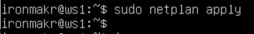
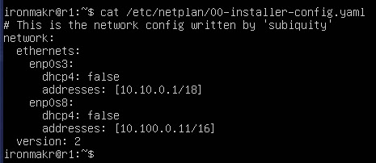
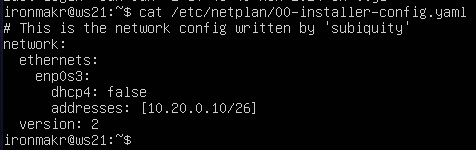
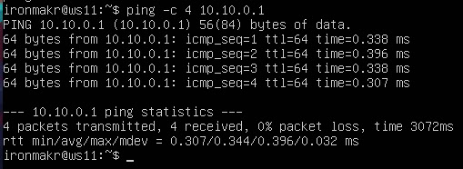
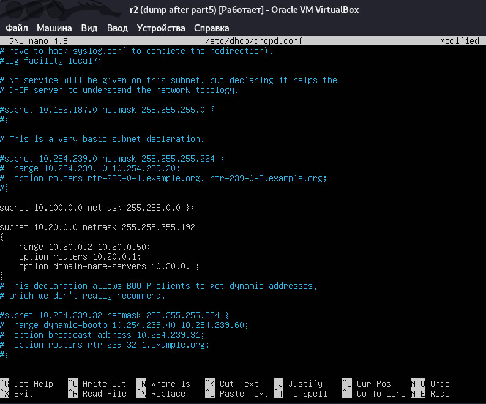
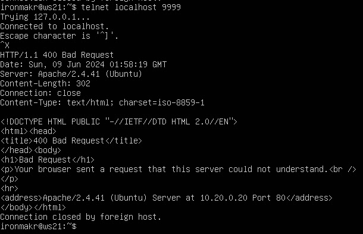
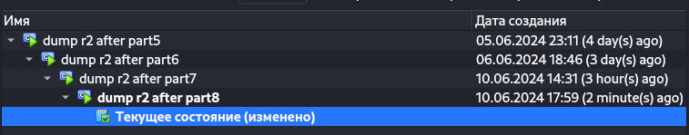

## Part 1. Инструмент **ipcalc**

**== Задание ==**

##### Подними виртуальную машину (далее -- ws1)
<br>

#### 1.1. Сети и маски
##### Определи и запиши в отчёт:

##### 1) Адрес сети *192.167.38.54/13*
<br>
- Адрес сети находится в строке Network: 192.160.0.0

##### 2) Перевод маски *255.255.255.0* в префиксную и двоичную запись, */15* в обычную и двоичную, *11111111.11111111.11111111.11110000* в обычную и префиксную

- Перевод маски 255.255.255.0 в префиксную и двоичную запись
<br><br>
Двоичная запись: <b>11111111.11111111.11111111.00000000</b><br>
Префиксная запись(количество единиц в двоичной записи) = <b>/24</b>


- Перевод маски /15 в обычную и двоичную
<br><br>
Обычная запись: <b>255.254.0.0</b><br>
Двоичная запись: <b>11111111.11111110.00000000.00000000</b>

- Перевод маски *11111111.11111111.11111111.11110000* в обычную и префиксную
<br>В этой маске 28 единиц, следовательно, префикс этой сети - /28
<br><br>
Обычная запись: <b>255.255.255.240</b><br>
Префиксная запись(количество единиц в двоичной записи) = <b>/28</b>

##### 3) Минимальный и максимальный хост в сети *12.167.38.4* при масках: */8*, *11111111.11111111.00000000.00000000*, *255.255.254.0* и */4*

- Минимальный и максимальный хост в сети *12.167.38.4* при маске /8<br>
<br>

- Минимальный и максимальный хост в сети *12.167.38.4* при маске 11111111.11111111.00000000.00000000(префикс /16)<br>
<br>

- Минимальный и максимальный хост в сети *12.167.38.4* при маске 255.255.254.0<br>
<br>

- Минимальный и максимальный хост в сети *12.167.38.4* при маске /4<br>
<br>


#### 1.2. localhost
##### Определи и запиши в отчёт, можно ли обратиться к приложению, работающему на localhost, со следующими IP: *194.34.23.100*, *127.0.0.2*, *127.1.0.1*, *128.0.0.1*

Для того, чтобы можно было обратиться к приложению, работающему на localhost, с конкретным IP необходимо, чтобы адрес находился в диапазоне от 127.0.0.1 до 127.255.255.254<br>
<br>

- 194.34.23.100 - нельзя обратиться
- 127.0.0.2 - можно обратиться
- 127.1.0.1 - можно обратиться
- 128.0.0.1 - нельзя обратиться

#### 1.3. Диапазоны и сегменты сетей
##### Определи и запиши в отчёт:
##### 1) Какие из перечисленных IP можно использовать в качестве публичного, а какие только в качестве частных: *10.0.0.45*, *134.43.0.2*, *192.168.4.2*, *172.20.250.4*, *172.0.2.1*, *192.172.0.1*, *172.68.0.2*, *172.16.255.255*, *10.10.10.10*, *192.169.168.1*

- *10.0.0.45* - частный
<br><br>

- *134.43.0.2* - публичный
<br><br>

- *192.168.4.2* - частный
<br><br>

- *172.20.250.4* - частный
<br><br>

- *172.0.2.1* - публичный
<br><br>

- *192.172.0.1* - публичный
<br><br>

- *172.68.0.2* - публичный
<br><br>

- *172.16.255.255* - частный
<br><br>

- *10.10.10.10* - частный
<br><br>

- *192.169.168.1* - публичный
<br><br>


##### 2) Какие из перечисленных IP адресов шлюза возможны у сети *10.10.0.0/18*: *10.0.0.1*, *10.10.0.2*, *10.10.10.10*, *10.10.100.1*, *10.10.1.255*
Адрес шлюза возможен, если адрес находится в диапазоне от 10.10.0.1 до 10.10.63.254<br>
<br>

- *10.0.0.1* - невозможен<br>
- *10.10.0.2* - возможнен<br>
- *10.10.10.10* - возможен<br>
- *10.10.100.1* - невозможен<br>
- *10.10.1.255* - возможен<br>


## Part 2. Статическая маршрутизация между двумя машинами

**== Задание ==**

##### Подними две виртуальные машины (далее -- ws1 и ws2).
<br>

##### С помощью команды `ip a` посмотри существующие сетевые интерфейсы.
- В отчёт помести скрин с вызовом и выводом использованной команды.

- ws1:<br>
<br>

- ws2:<br>
<br>

##### Опиши сетевой интерфейс, соответствующий внутренней сети, на обеих машинах и задать следующие адреса и маски: ws1 - *192.168.100.10*, маска */16*, ws2 - *172.24.116.8*, маска */12*.

Описание сетевых интерфейсов:
- ws1:
1) lo - 127.0.0.1/8
2) enp0s3 - 10.0.2.15/24

- ws2:
1) lo - 127.0.0.1/8
2) enp0s3 - 10.0.2.15/24

- В отчёт помести скрины с содержанием изменённого файла *etc/netplan/00-installer-config.yaml* для каждой машины.

- ws1:<br>
<br>

- ws2:<br>
<br>

##### Выполни команду `netplan apply` для перезапуска сервиса сети.
- В отчёт помести скрин с вызовом и выводом использованной команды.
- ws1:<br>
<br>

- ws2:<br>
<br>

#### 2.1. Добавление статического маршрута вручную
##### Добавь статический маршрут от одной машины до другой и обратно при помощи команды вида `ip r add`.
- ws1: - ip r add 172.24.116.8 dev enp0s3 
- ws2: - ip r add 192.168.100.10 dev enp0s3 
##### Пропингуй соединение между машинами.
- ws1: - ping 172.24.116.8 -c 4
- ws2: - ping 192.168.100.10 -c 4

- В отчёт помести скрин с вызовом и выводом использованных команд.
- ws1:<br>
<br>

- ws2:<br>
<br>

#### 2.2. Добавление статического маршрута с сохранением
##### Перезапусти машины.
- $ reboot
##### Добавь статический маршрут от одной машины до другой с помощью файла *etc/netplan/00-installer-config.yaml*.
- В отчёт помести скрин с содержанием изменённого файла *etc/netplan/00-installer-config.yaml*.
- ws1:<br>
<br>

- ws2:<br>
<br>
- $ sudo netplan apply - чтобы сохранить изменения настроек.

##### Пропингуй соединение между машинами.
- В отчёт помести скрин с вызовом и выводом использованной команды.
- ws1:<br>
<br>

- ws2:<br>
<br>

## Part 3. Утилита **iperf3**

**== Задание ==**

#### 3.1. Скорость соединения
##### Переведи и запиши в отчёт: 8 Mbps в MB/s, 100 MB/s в Kbps, 1 Gbps в Mbps.
- 8 Mbps == 1 MB/s
- 100 MB/s == 800000 Kbps
- 1 Gbps == 1000 Mbps

#### 3.2. Утилита **iperf3**
##### Измерь скорость соединения между ws1 и ws2.

1) Запускаем iperf3 на ws2 в режиме сервера с помощью команды:<br>
- $ iperf3 -s -f K

2) Затем на ws1 запускаем iperf3 в режиме клиента с помощью команды:<br>
- $ iperf3 -c 172.24.116.8 -f K

- В отчёт помести скрины с вызовом и выводом использованных команд.
- ws1:<br>
<br>

- ws2:<br>
<br>

## Part 4. Сетевой экран

**== Задание ==**

#### 4.1. Утилита **iptables**
##### Создай файл */etc/firewall.sh*, имитирующий фаерволл, на ws1 и ws2:
```shell
#!/bin/sh

# Удаление всех правил в таблице «filter» (по-умолчанию).
iptables -F
iptables -X
```
##### Нужно добавить в файл подряд следующие правила:
##### 1) На ws1 примени стратегию, когда в начале пишется запрещающее правило, а в конце пишется разрешающее правило (это касается пунктов 4 и 5).
##### 2) На ws2 примени стратегию, когда в начале пишется разрешающее правило, а в конце пишется запрещающее правило (это касается пунктов 4 и 5).
##### 3) Открой на машинах доступ для порта 22 (ssh) и порта 80 (http).
##### 4) Запрети *echo reply* (машина не должна «пинговаться», т.е. должна быть блокировка на OUTPUT).
##### 5) Разреши *echo reply* (машина должна «пинговаться»).
- В отчёт помести скрины с содержанием файла */etc/firewall* для каждой машины.
- ws1:<br>
<br>

- ws2:<br>
<br>

##### Запусти файлы на обеих машинах командами `chmod +x /etc/firewall.sh` и `/etc/firewall.sh`.
- В отчёт помести скрины с запуском обоих файлов;
- ws1:<br>
<br>

- ws2:<br>
<br>

- В отчёте опиши разницу между стратегиями, применёнными в первом и втором файлах.<br>
Если сначала писать запрещающее правило, а затем разрешающее, то запрещающее будет перекрывать разрешающее - следовательно, ws1 невозможно пропинговать, а ws2 возможно.

#### 4.2. Утилита **nmap**
##### Командой **ping** найди машину, которая не «пингуется», после чего утилитой **nmap** покажи, что хост машины запущен.
*Проверка: в выводе nmap должно быть сказано: `Host is up`*.
- В отчёт помести скрины с вызовом и выводом использованных команд **ping** и **nmap**.
- ws1:<br>
<br>
Видно, что ws1 не пингуется, поэтому нужно будет применить nmap на ws2.

- ws2:<br>
<br>
<br>

##### Сохрани дампы образов виртуальных машин
<p><a name="part4" href="#dumps">К дампам</a></p>

## Part 5. Статическая маршрутизация сети

**== Задание ==**

Сеть: \


##### Подними пять виртуальных машин (3 рабочие станции (ws11, ws21, ws22) и 2 роутера (r1, r2)).
<br>

#### 5.1. Настройка адресов машин
##### Настрой конфигурации машин в *etc/netplan/00-installer-config.yaml* согласно сети на рисунке.
- В отчёт помести скрины с содержанием файла *etc/netplan/00-installer-config.yaml* для каждой машины.

- r1:<br>
<br>
- r2:<br>
<br>
- ws11:<br>
<br>
- ws22:<br>
<br>
- ws21:<br>
<br>

##### Перезапусти сервис сети. Если ошибок нет, то командой `ip -4 a` проверь, что адрес машины задан верно. Также пропингуй ws22 с ws21. Аналогично пропингуй r1 с ws11.
- В отчёт помести скрины с вызовом и выводом использованных команд.

- r1:<br>
<br>
- r2:<br>
<br>
- ws11:<br>
<br>
- ws22:<br>
<br>
- ws21:<br>
<br>
- ping ws22 from ws21:<br>
<br>
- ping r1 from ws11:<br>
<br>

#### 5.2. Включение переадресации IP-адресов
##### Для включения переадресации IP, выполни команду на роутерах:
`sysctl -w net.ipv4.ip_forward=1`
*При таком подходе переадресация не будет работать после перезагрузки системы.*
- В отчёт помести скрин с вызовом и выводом использованной команды.
- r1:<br>
<br>
- r2:<br>
<br>

##### Открой файл */etc/sysctl.conf* и добавь в него следующую строку:
`net.ipv4.ip_forward = 1`
*При использовании этого подхода, IP-переадресация включена на постоянной основе.*
- В отчёт помести скрин с содержанием изменённого файла */etc/sysctl.conf*.
- r1:<br>
<br>
- r2:<br>
<br>

#### 5.3. Установка маршрута по-умолчанию
Пример вывода команды `ip r` после добавления шлюза:
```
default via 10.10.0.1 dev eth0
10.10.0.0/18 dev eth0 proto kernel scope link src 10.10.0.2
```
##### Настрой маршрут по-умолчанию (шлюз) для рабочих станций. Для этого добавь `default` перед IP роутера в файле конфигураций.
- В отчёт помести скрин с содержанием файла *etc/netplan/00-installer-config.yaml*;
- ws11:<br>
<br>
- ws22:<br>
<br>
- ws21:<br>
<br>

##### Вызови `ip r` и покажи, что добавился маршрут в таблицу маршрутизации.
- В отчёт помести скрин с вызовом и выводом использованной команды.
- ws11:<br>
<br>
- ws22:<br>
<br>
- ws21:<br>
<br>

##### Пропингуй с ws11 роутер r2 и покажи на r2, что пинг доходит. Для этого используй команду:
`tcpdump -tn -i eth0`
- В отчёт помести скрин с вызовом и выводом использованных команд.
- tcpdump:<br>
<br>
- ws21:<br>
<br>

#### 5.4. Добавление статических маршрутов
##### Добавь в роутеры r1 и r2 статические маршруты в файле конфигураций. Пример для r1 маршрута в сетку 10.20.0.0/26:
```shell
# Добавь в конец описания сетевого интерфейса eth1:
- to: 10.20.0.0
  via: 10.100.0.12
```
- В отчёт помести скрины с содержанием изменённого файла *etc/netplan/00-installer-config.yaml* для каждого роутера.
- r1:<br>
<br>
- r2:<br>
<br>

##### Вызови `ip r` и покажи таблицы с маршрутами на обоих роутерах. Пример таблицы на r1:
```
10.100.0.0/16 dev eth1 proto kernel scope link src 10.100.0.11
10.20.0.0/26 via 10.100.0.12 dev eth1
10.10.0.0/18 dev eth0 proto kernel scope link src 10.10.0.1
```
- В отчёт помести скрин с вызовом и выводом использованной команды.
- r1:<br>
<br>
- r2:<br>
<br>

##### Запусти команды на ws11:
`ip r list 10.10.0.0/[маска сети]` и `ip r list 0.0.0.0/0`
- В отчёт помести скрин с вызовом и выводом использованных команд;
- r2:<br>
<br>
- В отчёте объясни, почему для адреса 10.10.0.0/\[маска сети\] был выбран маршрут, отличный от 0.0.0.0/0, хотя он попадает под маршрут по-умолчанию
<br>
Так происходит, потому что этот маршрут 10.10.0.0/18 обладает бОльшей точностью.


#### 5.5. Построение списка маршрутизаторов
Пример вывода утилиты **traceroute** после добавления шлюза:
```
1 10.10.0.1 0 ms 1 ms 0 ms
2 10.100.0.12 1 ms 0 ms 1 ms
3 10.20.0.10 12 ms 1 ms 3 ms
```
##### Запусти на r1 команду дампа:
`tcpdump -tnv -i eth0`
##### При помощи утилиты **traceroute** построй список маршрутизаторов на пути от ws11 до ws21.
- В отчёт помести скрины с вызовом и выводом использованных команд (tcpdump и traceroute);
- r1:<br>
<br>
- ws11:<br>
<br>

- В отчёте, опираясь на вывод, полученный из дампа на r1, объясни принцип работы построения пути при помощи **traceroute**.<br>
Утилита отправляет 3 UDP-пакета, предназначенных для целевого узла, через транзитные (нецелевые) узлы. В заголовках передаваемых пакетов поддерживается TTL-поле. Оно указывает на время жизни. Оно определяет количество узлов, через которые пакет может пройти. На каждом узле TTL уменьшается на единицу. Если на пути к удаленному адресату время жизни пакета станет равно 0, маршрутизатор отбросит пакет и отправит источнику ICMP-сообщение об ошибке «Time Exceeded» (время истекло).

#### 5.6. Использование протокола **ICMP** при маршрутизации
##### Запусти на r1 перехват сетевого трафика, проходящего через eth0 с помощью команды:
`tcpdump -n -i eth0 icmp`

##### Пропингуй с ws11 несуществующий IP (например, *10.30.0.111*) с помощью команды:
`ping -c 1 10.30.0.111`
- В отчёт помести скрин с вызовом и выводом использованных команд.
- r1:<br>
<br>
- ws11:<br>
<br>

##### Сохрани дампы образов виртуальных машин.
<p><a name="part5" href="#dumps">К дампам</a></p>

## Part 6. Динамическая настройка IP с помощью **DHCP**

**== Задание ==**

##### Для r2 настрой в файле */etc/dhcp/dhcpd.conf* конфигурацию службы **DHCP**:
##### 1) Укажи адрес маршрутизатора по-умолчанию, DNS-сервер и адрес внутренней сети. Пример файла для r2:
```shell
subnet 10.100.0.0 netmask 255.255.0.0 {}

subnet 10.20.0.0 netmask 255.255.255.192
{
    range 10.20.0.2 10.20.0.50;
    option routers 10.20.0.1;
    option domain-name-servers 10.20.0.1;
}
```
##### 2) В файле *resolv.conf* пропиши `nameserver 8.8.8.8`.
- В отчёт помести скрины с содержанием изменённых файлов.<br>
- dhcpd.conf on r2:<br>
<br>
- resolv.conf on r2:<br>
<br>

##### Перезагрузи службу **DHCP** командой `systemctl restart isc-dhcp-server`. Машину ws21 перезагрузи при помощи `reboot` и через `ip a` покажи, что она получила адрес. Также пропингуй ws22 с ws21.
- В отчёт помести скрины с вызовом и выводом использованных команд.<br>
- restart dhcp service on r2:<br>
<br>

- $ reboot // ws21
- ip a on ws21 + ping ws22 from ws21:<br>
<br>

##### Укажи MAC адрес у ws11, для этого в *etc/netplan/00-installer-config.yaml* надо добавить строки: `macaddress: 10:10:10:10:10:BA`, `dhcp4: true`.
- В отчёт помести скрин с содержанием изменённого файла *etc/netplan/00-installer-config.yaml*.<br>
<br>

##### Для r1 настрой аналогично r2, но сделай выдачу адресов с жесткой привязкой к MAC-адресу (ws11). Проведи аналогичные тесты.
- В отчёте этот пункт опиши аналогично настройке для r2.
- dhcpd.conf on r1:<br>
<br>
- resolv.conf on r1:<br>
<br>
- restart dhcp service on r1:<br>
<br>

- $ reboot // ws11
- ip a after reboot:<br>
<br>

##### Запроси с ws21 обновление ip адреса.
- В отчёте помести скрины ip до и после обновления.
- ip a before update:<br>
<br>

- update + ip a after update:<br>
<br>

- В отчёте опиши, какими опциями **DHCP** сервера пользовался в данном пункте.<br>
Флаг -r явно освобождает адрес и после этого клиент завершает работу.<br>
Команда <em>sudo dhclient -r enp0s3</em> освобождает предыдущий адрес.<br>
Затем команда <em>sudo dhclient enp0s3</em> присваивает новый адрес.

##### Сохрани дампы образов виртуальных машин.
<p><a name="part6" href="#dumps">К дампам</a></p>

## Part 7. **NAT**

**== Задание ==**

*В данном задании используются виртуальные машины из Части 5.*
##### В файле */etc/apache2/ports.conf* на ws22 и r1 измени строку `Listen 80` на `Listen 0.0.0.0:80`, то есть сделай сервер Apache2 общедоступным.
- В отчёт помести скрин с содержанием изменённого файла.
- r1:<br>
<br>
- ws22:<br>
<br>

##### Запусти веб-сервер Apache командой `service apache2 start` на ws22 и r1.
- В отчёт помести скрины с вызовом и выводом использованной команды.
- r1:<br>
<br>
- ws22:<br>
<br>

##### Добавь в фаервол, созданный по аналогии с фаерволом из Части 4, на r2 следующие правила:
##### 1) Удаление правил в таблице filter - `iptables -F`;
##### 2) Удаление правил в таблице "NAT" - `iptables -F -t nat`;
##### 3) Отбрасывать все маршрутизируемые пакеты - `iptables --policy FORWARD DROP`.
- current firewall:<br>
<br>

##### Запусти файл также, как в Части 4.
- starting firewall:<br>
<br>

##### Проверь соединение между ws22 и r1 командой `ping`.
*При запуске файла с этими правилами, ws22 не должна «пинговаться» с r1.*
- В отчёт помести скрины с вызовом и выводом использованной команды.
- ping ws22:<br>
<br>

##### Добавь в файл ещё одно правило:
##### 4) Разрешить маршрутизацию всех пакетов протокола **ICMP**.
- current firewall:<br>
<br>

##### Запусти файл также, как в Части 4.
- starting firewall:<br>
<br>

##### Проверь соединение между ws22 и r1 командой `ping`.
*При запуске файла с этими правилами, ws22 должна «пинговаться» с r1.*
- В отчёт помести скрины с вызовом и выводом использованной команды.
- ping ws22:<br>
<br>

##### Добавь в файл ещё два правила:
##### 5) Включи **SNAT**, а именно маскирование всех локальных ip из локальной сети, находящейся за r2 (по обозначениям из Части 5 - сеть 10.20.0.0).
*Совет: стоит подумать о маршрутизации внутренних пакетов, а также внешних пакетов с установленным соединением.*
##### 6) Включи **DNAT** на 8080 порт машины r2 и добавить к веб-серверу Apache, запущенному на ws22, доступ извне сети.
*Совет: стоит учесть, что при попытке подключения возникнет новое tcp-соединение, предназначенное ws22 и 80 порту.*
- В отчёт помести скрин с содержанием изменённого файла.
- current firewall:<br>
<br>

##### Запусти файл также, как в Части 4.
- starting firewall:<br>
<br>

*Перед тестированием рекомендуется отключить сетевой интерфейс **NAT** (его наличие можно проверить командой `ip a`) в VirtualBox, если он включен.*
##### Проверь соединение по TCP для **SNAT**: для этого с ws22 подключиться к серверу Apache на r1 командой:
`telnet [адрес] [порт]`
- telnet r1 from ws22:<br>
<br>

##### Проверь соединение по TCP для **DNAT**: для этого с r1 подключиться к серверу Apache на ws22 командой `telnet` (обращаться по адресу r2 и порту 8080).
- В отчёт помести скрины с вызовом и выводом использованных команд.
- telnet ws22 from r1:<br>
<br>

##### Сохрани дампы образов виртуальных машин
<p><a name="part7" href="#dumps">К дампам</a></p>

## Part 8. Дополнительно. Знакомство с **SSH Tunnels**

**== Задание ==**

*В данном задании используются виртуальные машины из Части 5.*

##### Запусти на r2 фаервол с правилами из Части 7.
<br>

##### Запусти веб-сервер **Apache** на ws22 только на localhost (то есть в файле */etc/apache2/ports.conf* измени строку `Listen 80` на `Listen localhost:80`).
<br>

##### Воспользуйся *Local TCP forwarding* с ws21 до ws22, чтобы получить доступ к веб-серверу на ws22 с ws21.
- $ ssh -L [local_port]:[remote_host]:[remote_host_port] [remote_ip] -p [ssh_port]<br>
<br>

##### Воспользуйся *Remote TCP forwarding* c ws11 до ws22, чтобы получить доступ к веб-серверу на ws22 с ws11.
- $ ssh -R [remote_port]:[local_host]:[local_host_port] [remote_ip] -p [ssh_port]<br>
<br>

##### Для проверки, сработало ли подключение в обоих предыдущих пунктах, перейди во второй терминал (например, клавишами Alt + F2) и выполни команду:
`telnet 127.0.0.1 [локальный порт]`
- В отчёте опиши команды, необходимые для выполнения этих четырёх пунктов, а также приложи скриншоты с их вызовом и выводом.
- Local TCP forwarding:<br>
<br>
- Remote TCP forwarding:<br>
<br>

##### Сохрани дампы образов виртуальных машин.
<p><a name="part8" href="#dumps">К дампам</a></p>

ДАМПЫ ИЗ 4 части:<br>
<a name="dumps" href="#part4">К части 4</a><br>
- ws1:<br>
<br>
- ws2:<br>
<br>


ДАМПЫ ИЗ 5, 6, 7, 8 частей:<br>
<a name="dumps" href="#part5">К части 5</a><br>
<a name="dumps" href="#part6">К части 6</a><br>
<a name="dumps" href="#part7">К части 7</a><br>
<a name="dumps" href="#part8">К части 8</a><br>
- r1:<br>
<br>
- r2:<br>
<br>
- ws21:<br>
<br>
- ws22:<br>
<br>
- ws11:<br>
<br>